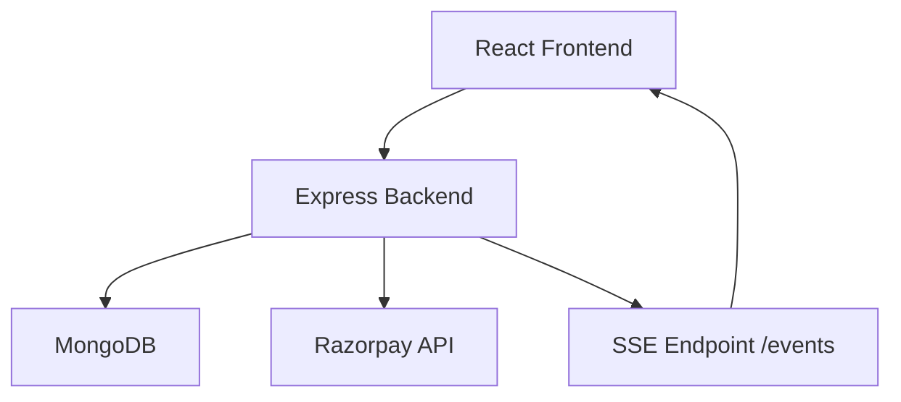
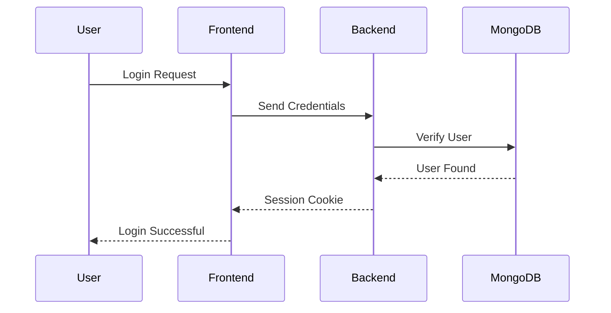
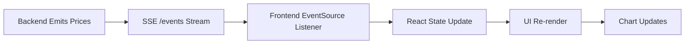
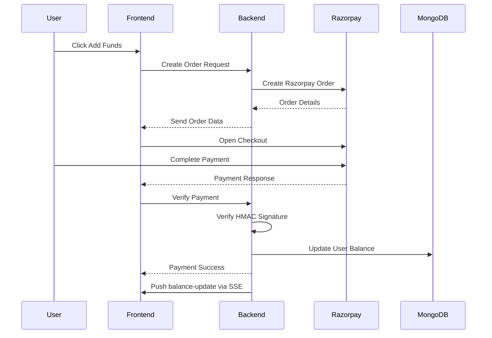

# 🚀 Zerodha Clone – Real-Time Trading Dashboard


A full-stack real-time trading dashboard inspired by Zerodha, built using the MERN stack.

This project simulates the core functionalities of a modern stock trading platform including:

- 🔐 Authentication & Session Management
- ⚡ Real-Time Stock Updates using Server-Sent Events (SSE)
- 💳 Razorpay Payment Gateway Integration
- 📈 Portfolio & Holdings Management
- 📊 Interactive Chart Visualizations
- 🧠 Context API State Management
- 🗄️ MongoDB Database Architecture

---

# 🌟 Features

## 🔐 Authentication System
- User Signup/Login
- Session-based Authentication using Passport.js
- Secure password hashing & salting
- Protected backend routes
- Persistent login using cookies & sessions

---

## ⚡ Real-Time Watchlist
- Live stock price updates using Server-Sent Events (SSE)
- Event-driven architecture
- Dynamic watchlist rendering
- Real-time chart updates
- Shared EventSource connection using Context API

---

## 💳 Razorpay Payment Integration
- Secure wallet funding system
- Razorpay checkout integration
- Backend payment verification using HMAC SHA256
- Real-time balance synchronization after successful payment

---

## 📊 Trading Dashboard
- Holdings management
- Position tracking
- Order management
- Profit/Loss calculations
- Interactive chart visualizations

---

## ⚛️ Frontend Architecture
- Component-based React architecture
- Nested routing using React Router
- Context API for global state management
- Dynamic rendering using React Hooks
- Modular & scalable frontend structure

---

# 🏗️ System Architecture



---

# 🔐 Authentication Flow



---

# ⚡ Real-Time Watchlist Flow



---

# 💳 Razorpay Payment Flow



---

# 📂 Project Structure

```bash
ZerodhaClone/
│
├── backend/
│   ├── middleware/
│   ├── model/
│   ├── routes/
│   ├── schemas/
│   ├── index.js
│
├── dashboard/
│   ├── src/
│   │   ├── components/
│   │   ├── context/
│   │   ├── pages/
│
├── frontend/
│   ├── src/
│   │   ├── landing_page/
│
├── README.md
```

---

# 🛠️ Tech Stack

## Frontend
- React.js
- React Router DOM
- Context API
- Material UI
- Chart.js

---

## Backend
- Node.js
- Express.js
- Passport.js
- Server-Sent Events (SSE)

---

## Database
- MongoDB
- Mongoose ODM

---

## Payment Gateway
- Razorpay

---

# 🚀 Installation & Setup

## Clone Repository

```bash
git clone https://github.com/your-username/ZerodhaClone.git
```

---

# 📦 Install Dependencies

## Backend

```bash
cd backend
npm install
```

---

## Dashboard

```bash
cd dashboard
npm install
```

---

## Frontend

```bash
cd frontend
npm install
```

---

# ▶️ Run Project

## Start Backend

```bash
npm start
```

---

## Start Dashboard

```bash
npm start
```

---

## Start Frontend

```bash
npm start
```

---

# 🧪 Running Specmatic

This repo uses [Specmatic](https://specmatic.io) to contract-test the backend against the OpenAPI spec in `contracts/openapi.yaml`, stub out the Razorpay dependency, and run an Arazzo end-to-end workflow. Everything runs via `docker-compose.yml` using the `specmatic/enterprise:latest` image — you do not need to install Specmatic locally, only Docker.

## 1. Prerequisites

- **Docker** and **Docker Compose** installed and running
- A **Specmatic Enterprise license** — get one from [specmatic.io](https://specmatic.io), save it as a file named `license.txt`
- This repo cloned locally

## 2. Place the License File

Every Specmatic service in `docker-compose.yml` mounts the license from **one directory above this repo**:

```yaml
volumes:
  - ../license.txt:/root/.specmatic/specmatic-license.txt:ro
```

So your folder layout needs to look like:

```
parent-folder/
├── license.txt              <-- put it here
└── zerodha-specmatic/       <-- this repo
    ├── docker-compose.yml
    ├── contracts/
    └── ...
```

If Specmatic can't find the license, every command below will fail immediately with a license/authentication error — check this path first.

## 3. Quick Start — Run Your First Contract Test

```bash
# 1. Start the app + its dependencies (Mongo, real backend, Razorpay stub)
docker compose up -d mongo backend razorpay-stub

# 2. Wait for the backend healthcheck to pass, then run the contract test
docker compose --profile test up
```

This runs `contracts/openapi.yaml` against the real backend on `http://backend:3002` and exits with a pass/fail summary. Tear everything down afterwards with:

```bash
docker compose down
```

## 4. All Available Labs (docker-compose profiles)

Each profile is self-contained; start it the same way — `docker compose --profile <name> up`:

| Profile | What it does |
|---|---|
| `test` | Contract test: runs `contracts/openapi.yaml` against the real backend |
| `stub` | Starts a consumer stub (fake backend) from the contract on port 9000 |
| `coverage` | Contract test + API coverage report |
| `examples` | Validates every example JSON against the contract schema |
| `partial` | Stub + test using partial examples (auto-fills missing required fields) |
| `response-template` | Stub + test for response templating (data lookups/echo) |
| `dictionary` | Stub + test using domain-aware values from `contracts/openapi_dictionary.yaml` |
| `filters` / `filters-post` / `filters-auth` | Stub + filtered test runs (by status, method, or auth paths) |
| `adapters` / `no-adapters` | Demonstrates request/response adapters bridging PascalCase ↔ camelCase |
| `workflow` | Stub + test showing ID propagation from `/create-order` into `/verify-payment` |
| `suite` | Runs the full `specmatic.yaml` v3 suite (auto-starts mock + runs tests) |
| `studio` | Specmatic Studio visual UI at `http://localhost:9000/_specmatic/studio` |
| `ci` | Spectral lint + backward-compatibility check + example validation (used in CI) |
| `async` | Kafka-based async contract test (stock-orders → order-confirmed) via `order-processor` |

## 5. Walkthrough of the Core Labs

**Stub a fake backend from the contract** (no real backend needed — useful for frontend development):
```bash
docker compose --profile stub up
# Fake API now live at http://localhost:9000, backed entirely by contracts/openapi.yaml
```

**Contract test + coverage report** (same as gate 2 in CI):
```bash
docker compose up -d mongo backend razorpay-stub
docker compose --profile coverage up
```

**Visual Specmatic Studio** (explore the contract, build/replay Arazzo workflows, run mocks/tests from a UI):
```bash
docker compose up -d mongo backend
docker compose --profile studio up
# Open http://localhost:9000/_specmatic/studio
```

**All CI checks locally** (lint + backward-compatibility + example validation):
```bash
docker compose --profile ci up
```

## 6. Running Specmatic Directly (matches CI, no compose)

The GitHub Actions workflows don't use `docker-compose` — they call the image directly so the exact same commands can be run on your machine:

```bash
# Contract test against a locally running backend (http://localhost:3002)
docker run --rm --network host \
  -v "$(pwd):/usr/src/app" \
  -v /path/to/license.txt:/root/.specmatic/specmatic-license.txt:ro \
  specmatic/enterprise:latest \
  test --testBaseURL=http://localhost:3002 contracts/openapi.yaml --examples=contracts/openapi_examples
```

```bash
# Backward-compatibility check against the committed baseline
docker run --rm \
  -v "$(pwd):/usr/src/app" \
  -v /path/to/license.txt:/root/.specmatic/specmatic-license.txt:ro \
  --entrypoint sh specmatic/enterprise:latest -c '
    mkdir -p /tmp/compat-check/contracts && cd /tmp/compat-check
    git init -q && git checkout -q -b main
    git config user.email ci@ci.local && git config user.name CI
    cp /usr/src/app/baseline/contracts/openapi.yaml contracts/openapi.yaml
    git add contracts/openapi.yaml && git commit -q -m baseline
    git checkout -q -b current
    cp /usr/src/app/contracts/openapi.yaml contracts/openapi.yaml
    git add contracts/openapi.yaml && git commit -q -m current
    specmatic backward-compatibility-check --base-branch=main --target-path=contracts/openapi.yaml
  '
```

## 7. Arazzo End-to-End Workflow

`ZerodhaTradeFlow.arazzo.yaml` (with data in `ZerodhaTradeFlow.arazzo_input.json`) chains **signup → login → get-me → place order → create order → verify payment** into one workflow. It was built visually in Specmatic Studio and exported.

Run it against a live backend:

```bash
docker compose up -d mongo backend razorpay-stub
docker run --rm -v "$(pwd):/usr/src/app" -v /path/to/license.txt:/root/.specmatic/specmatic-license.txt:ro \
  specmatic/enterprise:latest test "ZerodhaTradeFlow.arazzo.yaml"
```

The HTML report is written to `./build/reports/specmatic/html`. You can also open and replay it interactively in Specmatic Studio (see the `studio` profile above).

## 8. Troubleshooting

| Symptom | Likely cause |
|---|---|
| Immediate license/auth error | `license.txt` missing or not at `../license.txt` relative to the repo |
| `test` profile fails to connect | Backend not healthy yet — check `docker compose ps` and backend healthcheck |
| Port already in use | Another lab profile using the same port (most stubs default to `9000`) — stop it with `docker compose --profile <name> down` first |
| Provider test fails on `qty` | Backend validation and the contract's `type: integer` must agree — see `backend/index.js`'s `/newOrder` handler |

## 9. CI

`.github/workflows/` runs three gates on every push, using the direct `docker run` form shown in section 6:
- `01-contract-repo-ci.yml` — Spectral lint + backward-compatibility check
- `02-provider-ci.yml` — contract tests against the real backend
- `03-consumer-ci.yml` — consumer stub tests against the frontend

---

# 🔑 Environment Variables

Create a `.env` file inside the backend folder:

```env
MONGO_URL=your_mongodb_connection_string

SESSION_SECRET=your_session_secret

RAZORPAY_KEY_ID=your_razorpay_key

RAZORPAY_KEY_SECRET=your_razorpay_secret
```

---

# 🧠 Key Engineering Concepts Used

- REST APIs
- Event-Driven Architecture
- Real-Time Communication
- Server-Sent Events (SSE)
- React Reconciliation
- Context API
- Session-Based Authentication
- Payment Gateway Integration
- HMAC Signature Verification
- MongoDB Schema Design
- Secure Password Hashing
- React Hooks
- Dynamic State Management

---

# 🚧 Future Improvements

- Redis Pub/Sub for scalable SSE broadcasting across multiple backend instances
- Webhook-based payment verification
- Advanced analytics dashboard
- Docker deployment
- CI/CD integration
- Order acknowledgement system
- Advanced portfolio insights
- Production-grade caching

---

# 👩‍💻 Author

## Priya R

Full Stack Developer | MERN Stack | Real-Time Systems Enthusiast

---

# ⭐ If you like this project

Give it a ⭐ on GitHub!